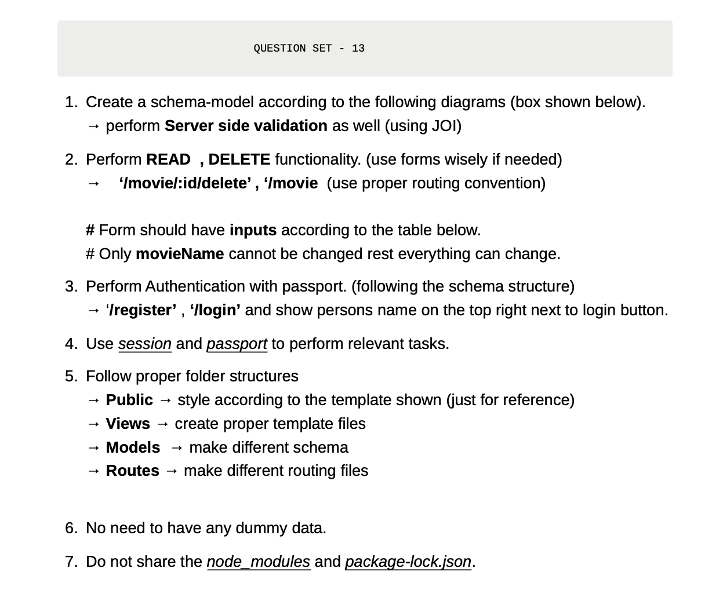
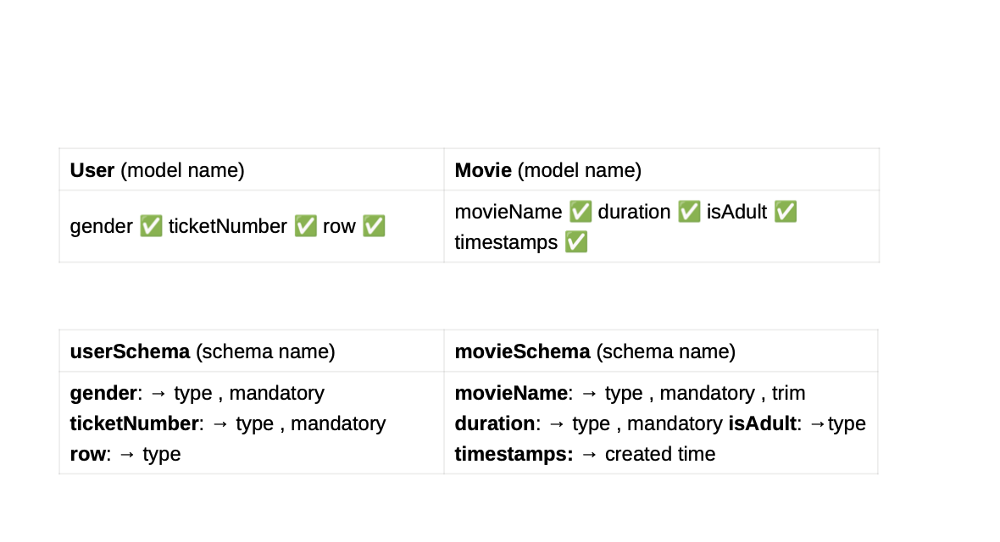

# Web Exam

Movie and user management exam project built with Express, MongoDB, EJS, JOI, session handling, and Passport authentication.

## Assignment Reference





## What Is Included

- User registration and login with Passport local strategy
- Session-based authentication
- JOI server-side validation for register, login, create movie, and update movie forms
- Movie create, read, update, and delete flows
- `movieName` locked during updates while the other movie fields remain editable
- Logged-in user's name shown in the top-right navigation
- Clean folder structure with `models`, `routes`, `views`, `public`, and `config`

## Project Structure

```text
web_exam/
├── app.js
├── config/
├── models/
├── public/
├── routes/
├── views/
└── assets/
```

## Run Locally

1. Clone the repository:

```bash
git clone https://github.com/codeharshit24/web_exam.git
cd web_exam
```

2. Create the environment file:

```bash
cp .env.example .env
```

3. Update `.env` with your MongoDB connection string and session secret:

```env
PORT=3000
MONGODB_URI=mongodb://127.0.0.1:27017/web_exam
SESSION_SECRET=replace-with-a-strong-secret
```

4. Install dependencies and start the server:

```bash
npm install
npm start
```

5. Open the app in your browser:

```text
http://localhost:3000
```

## Notes

- `node_modules` and `package-lock.json` are ignored as requested.
- MongoDB must be running locally, or `MONGODB_URI` should point to a working remote database.
